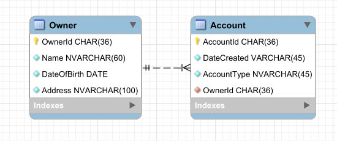

# ASP .NET Core WebApi


## _An Web Api for learning purposes with EF + MySql and Angular FrontEnd_


This WebApi is build based on the amazing ASP .NET Core Guide available at https://code-maze.com/net-core-series/

I took this guide for learning the core aspects of a robust WEBApi with Repository Pattern and connection to MySQL Database.

As always, as I'm going through other interesting tools and concepts, I probably add in this project (pagination, Elasticsearch, ...)



## Objectives

Develop a robust and scalable WebAPI in ASP .NET with consumption in an Angular FrontEnd

* Work with C# and ASP Net Development
* Work with Entity Framework + MySQL (Dockerized)
* Work with Docker Container
* Develop a scalable WebAPI with Repository Pattern
* Use NLog for logging errors to file (and stdout when deployed)
* Work with Angular Framework
* Work with GIT
* Work with relational database (SQL)
* ... Should add more things down the road...

## To-do

- JWT Authentication and Authorization
- Angular FrontEnd
- Pagination, ElasticSearch
- Dockerize the app
- Deploy the final app (Probably in the Azure Platform)
- Implement Unity Testing

## Dependencies

* Entity Framework
* NLog
* Pomelo MySql package
* AutoMapper

## Run

Run MySQL Docker Container

```sh
docker run --name docker-mysql
    -p 3306:3306
    -e MYSQL_ROOT_PASSWORD=biscoito
    -d mysql
```

Build and Run the WebAPI

```sh
cd AccountOwnerServer
dotnet restore
dotnet build
dotnet run --project AccountOwnerServer
```
